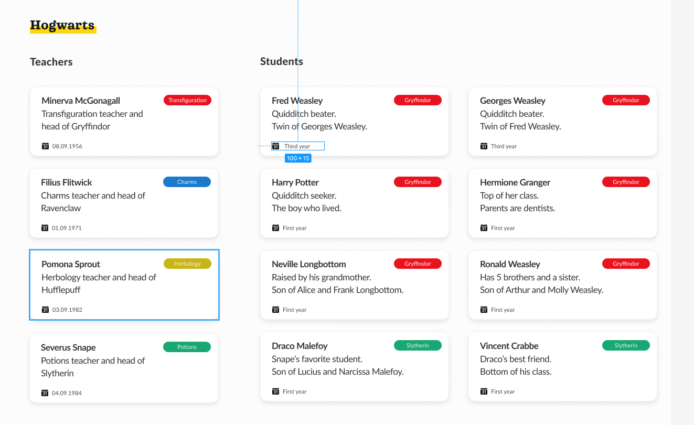

# Technical Test
From this figma design :  write a single web page that works with the JSON data in [data.json](data.json) as if it was coming from a server call.

## Instructions
- The assignment can be done in any of the following framework :
    - Angular (prefered)
    - Vue.js
    - React.js
    - Without any framework with HTML, SCSS & TypeScript; the use of at least one parent and one child component is preferred.
-  Code must be with a readme explaining how to run the web page, or the code can also be hosted on a GitHub Page. 
- Code can be sent in compressed format or on a public repository
- Date of the day is 12 November 1991
- Teachers need to be printed from date of arrival in the school
- Students must be printed by house order, then by alphabetic order inside of each house.

🎁 Help :

If you never used [Figma](https://www.figma.com/fr/best-practices/tips-on-developer-handoff/#an-overview-of-figma-for-developers)

If you never used a front-end framework and you want to learn [Angular](https://angular.io/tutorial/tour-of-heroes)

🏆 Bonus :
Make it responsive for mobile phone

## Test conclusion (my own)
I successfully followed 3 out of 4 instructions for the test : 
- I added a .md file explaining how to run locally the project and I'll also publish it on [GitHub Page](https://jibe7.github.io/2024-Test-Technique/). 🆗 
- I created TypeScript class and typed all the variables of the code 🆗
- I put the final repository on GitHub (public) 🆗
- I did it without framework using HTML, TypeScript, but I used only CSS instead of SCSS that I didn't know at the time of the assignment ❌

## Personnal conclusion
- Git and Github : I was not very consistent with my commit style (what text do i put in the commit message, which language...) but I thought it would not be necessary for a technical test where my goal was to get done with it asap; as other candidates had already started/done the project. For this reason also I tried to do everything as fast as possible with my current knowledge (HTML/CSS/JavaScript only) and did it with no framework but learnt to use TypeScript on the go, despite the fact that the instruction said that there was no time limit.
- Figma design reproduction : I struggled at the beginning because I was trying to follow precisely the dimension and sizes provided in the Figma design as well as making it responsive. I then changed my approached and focused on making it look like the design but not with the exact size for it to be responsive and it went better that way. I was pretty happy with it, there was no longer deformations of the different items on the screen. I would have liked to have made commits more frequently so that I would be able to look at the responsiveness now and at the moment it (sizes, margin etc) was defined with pixel unit.
- Loading the JSON content : As I had never used TypeScript I'm happy because I learnt the basics (defining types). I produced result as quick as possible and I got a functionnal script for the required task.

Overall I'm happy to have done that project, it was challenging and it allowed me to produce a design different from what I have done before. 
I have spent around 9hrs on it on 3days, the first two hours were not good (unresponsive design, styling not finished), the next 6hrs were really good (not all productive but did a lot : retake what was done to make it responsive, finished the styling, created most of the typescript code but it was not working well) and the last 1hr was also good (made the script working, added media queries and completed the github repo).
I have still much to learn (frameworks, tools...) to become faster and better at reproducing web pages but I definitly enjoy that work.
